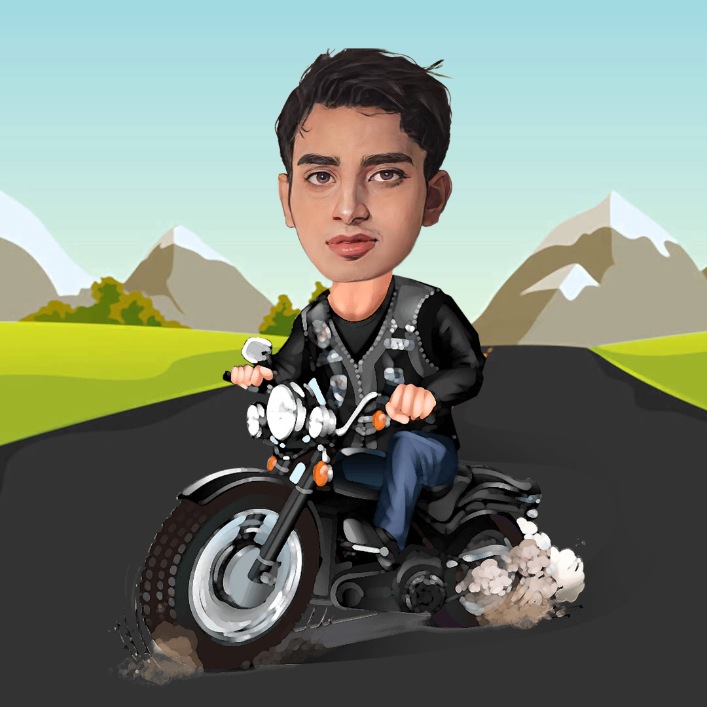

### Hi, I am a Software Engineer from Bangalore, India. 

I love experimenting with new technologies and playing around with code. You can check out some of my projects and experiments on my GitHub. If you want to discuss anything about web technologies or software development, feel free to connect with me. How to reach me? Drop me a 📨 on my <a href="https://www.linkedin.com/in/shivam-s-27a406208/">LinkedIn</a>. Apart from all this stuff i like visiting wildlife scantuaries, motorcycling, long rides.

 
 
 
 
 
 
 
 
 
 
 

 
